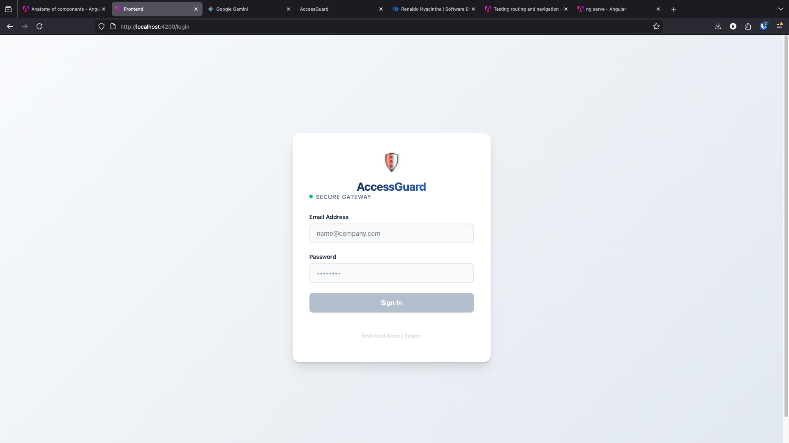
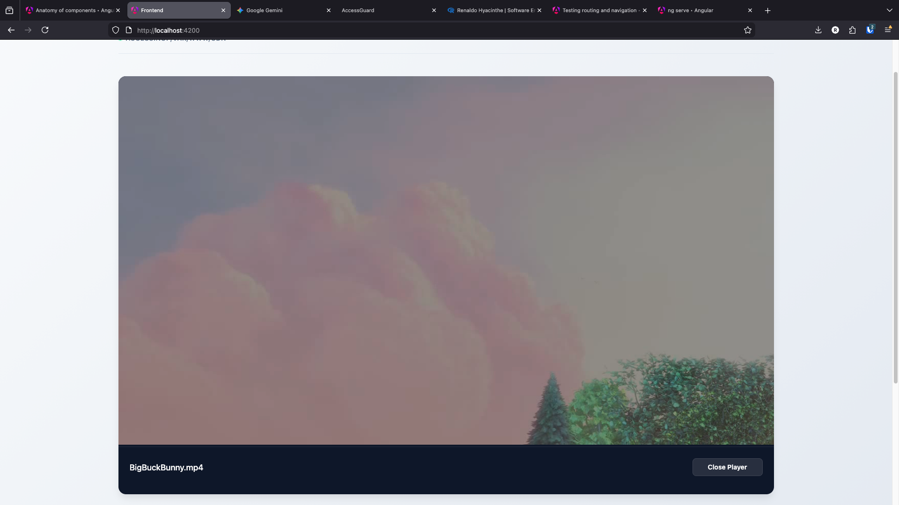
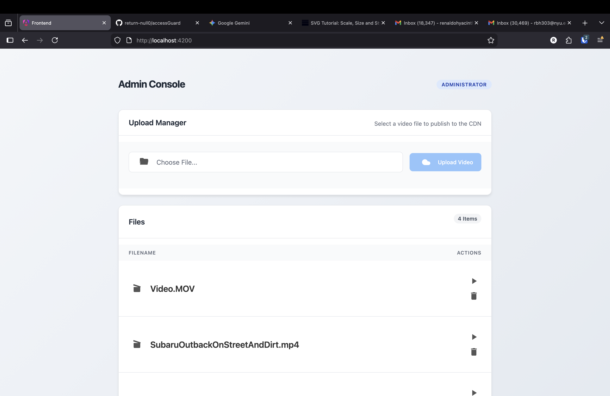
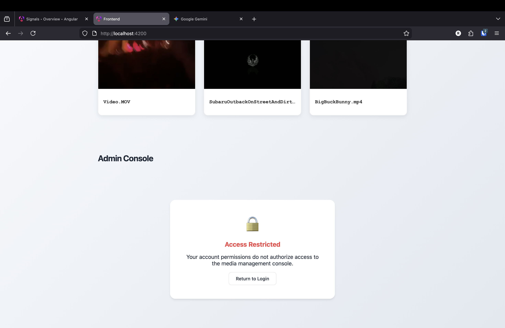
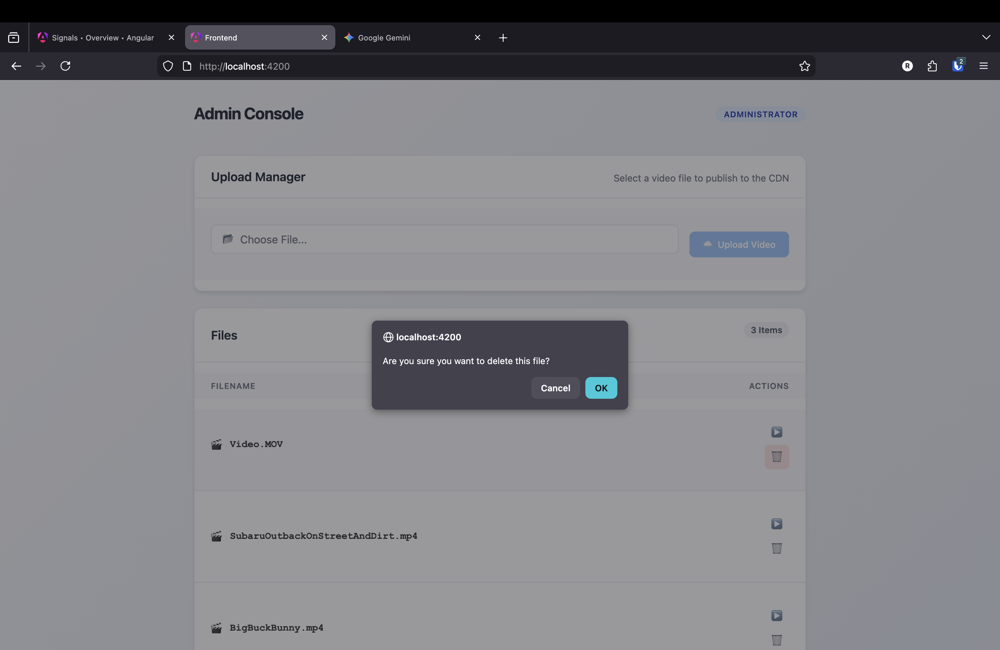

# AccessGuard

> A secure, containerized video streaming platform featuring a modern Angular frontend, Spring Boot backend, and robust JWT authentication.


## Overview

AccessGuard is a full-stack application designed to securely manage and stream video content from a local server to a web interface. It uses a **Stateless JWT architecture** to ensure secure access to API endpoints while serving media files efficiently through a protected resource handler.

The system is fully containerized using Docker, mapping a local directory on your host machine to a virtual volume inside the backend container.








## Key Features

* **JWT Authentication:** Secure login system with stateless token management.
* **Secure Media Streaming:** Streams video files directly from a protected host directory.
* **Modern Dashboard:** "Dark Glass" aesthetic UI built with Angular, featuring video previews and an embedded player.
* **Docker Integration:** Full stack (Frontend + Backend + DB) orchestration via Docker Compose.
* **Role-Based Security:** Spring Security configuration with protected API routes and public media whitelisting.
* **Interceptors:** Automatic HTTP interception to attach auth tokens to outgoing requests.

## Tech Stack

**Frontend**
* **Framework:** Angular 17+ (Standalone Components)
* **Styling:** CSS3 
* **Routing:** Angular Router with Auth Guards

**Backend**
* **Core:** Spring Boot 3 (Java 17)
* **Security:** Spring Security 6, JJWT
* **Data:** Postgres Database Image; Production Ready
* **Build Tool:** Maven

**Infrastructure**
* Docker & Docker Compose

## Getting Started

### Prerequisites
* Docker Desktop installed and running.
* Node.js (v18+) & Angular CLI (for local frontend dev).
* A folder on your Desktop named `aguploads` containing `.mp4` files to be mounted and served by Docker container.

### 1. Clone the Repository
```bash
git clone https://github.com/return-null0/accessguard.git
cd accessguard
```

### 2. Configure the Backend (Docker)
Ensure your `docker-compose.yml` maps your local video folder correctly.
* **Mac/Linux:** `~/Desktop/aguploads:/var/www/cdn`
* **Windows:** `C:/Users/YourName/Desktop/aguploads:/var/www/cdn`

**Run the backend:**
```bash
docker-compose up -d --build
```

### 3. Run the Frontend
You can run the frontend locally for development:
```bash
cd frontend
npm install
ng serve
```
Navigate to `http://localhost:4200`.

## Usage

1.  **Login:** Use the admin credentials or default user:
    * **Email:** `admin@email.com`
    * **Password:** `admin123`
    * **Email:** `renaldo.dev@email.com`
    * **Password:** `password`
2.  **Dashboard:** Upon successful login, you will be redirected to the secure video library.
3.  **Playback:** Click any video card to load it into the main player stage.
4.  **Logout:** Click the "Sign Out" button in the sidebar to clear your session.

## Configuration

**Video Path:**
To change where videos are stored, update `WebConfig.java` and your `docker-compose.yml` volume mapping.
